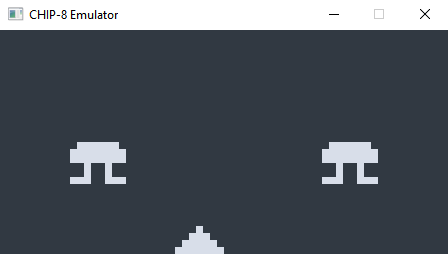
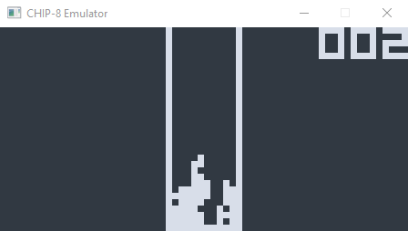
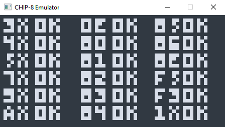

# CHIP - 8

CHIP-8 emulator written by following this [guide](https://tobiasvl.github.io/blog/write-a-chip-8-emulator/) in order to learn about emulator and Rust.

## Building

This program use sdl2 crate. Follow [this](https://github.com/Rust-SDL2/rust-sdl2#requirements) on how to install it.

and then execute:

    $ cargo build --release

## Usage

    $ chip-8 <path to rom>

----------

## Keypad

To emulate keypad in chip-8, this emulator used keyboard as follow

<kbd>1</kbd> <kbd>2</kbd> <kbd>3</kbd> <kbd>4</kbd>\
<kbd>Q</kbd> <kbd>W</kbd> <kbd>E</kbd> <kbd>R</kbd>\
<kbd>A</kbd> <kbd>S</kbd> <kbd>D</kbd> <kbd>F</kbd>\
<kbd>Z</kbd> <kbd>X</kbd> <kbd>C</kbd> <kbd>V</kbd>

which will be emulated to this layout

<kbd>1</kbd> <kbd>2</kbd> <kbd>3</kbd> <kbd>C</kbd>\
<kbd>4</kbd> <kbd>5</kbd> <kbd>6</kbd> <kbd>D</kbd>\
<kbd>7</kbd> <kbd>8</kbd> <kbd>9</kbd> <kbd>E</kbd>\
<kbd>A</kbd> <kbd>0</kbd> <kbd>B</kbd> <kbd>F</kbd>

## Screnshots

